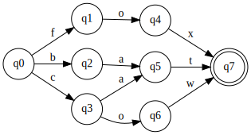
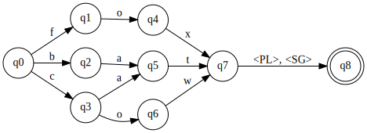
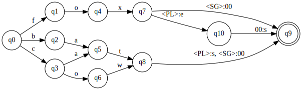
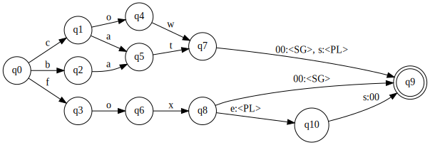

# A simple demonstration of finite-state morphological analysis with Xerox formalisms

This is a very short tutorial on using Xerox lexc/xfst languages
for defining a morphological analyzer.

We demonstrate the construction of
a typical finite-state morphological analyzer
through modeling English noun pluralization.
We use xfst and lexc, two well-known FST specification languages,
for this exercise.
These languages were originally developed by Xerox,
and used for constructing morphological analyzers for
a large number of languages.
For the demo below,
you can use one of the free/open source implementations.

- [hfst-xfst](https://github.com/hfst/hfst/wiki/HfstXfst)
which is part of [HFST](https://hfst.github.io/)
- [Foma](https://fomafst.github.io/).

To replicate the steps below, you may want to install one of these
implementations (follow the links for the installation instructions).

## Xfst and Lexc

Xfst is a formalism for specifying finite-state transducers
using regular expressions
(you may find its regular expression syntax syntax somewhat odd, though).
Specifying long list of words may get rather clumsy in in xfst.
In practice, it is used with _lexc_, another formalism designed for
specifying lexicons in a more convenient way.

Xfst provides an interactive command-line interface for defining and
using FSTs. You can get to this command-line interface by typing
`hfst-xfst` or `foma` on the operating system's command line.

We will not go thorough a description of xfst and lexc  formalisms here.
The descriptions are limited to the examples demonstrated.
The authoritative reference for Xerox tools and formalisms is
[Beesley and Karttunen (2003)](https://www.press.uchicago.edu/ucp/books/book/distributed/F/bo3613750.html)
(tip: you may find a pre-print copy electronic with a web search).
[HFST](https://hfst.github.io/) and [Foma](https://fomafst.github.io/)
web pages include some reference documentation and also links
to (other) tutorials.

## Defining a lexicon

You can define a regular expression on xfst command line using
`define regex` or simply `regex` command.
To define a regular lexicon accepting words
_cat_, _cow_, _bat_ and _fox_,
we can simply type

```
hfst[0]: regex {cat}|{cow}|{bat}|{fox};
? bytes. 8 states, 10 arcs, ? paths
hfst[1]: view net
Writing net in dot format to temporary file '/tmp/hfstGFoIiQ'.
Wrote net, closing file and converting into png format.
Converted to png format, viewing the graph.
hfst[1]: define nouns
Defined 'nouns'
```
The command `view net` displays the network, which is shown below.


The curly braces makes sure that the symbols of the lexicon
is the individual letters. Without the curly braces, the words would
be treated as atomic symbols (which we do not want in this case).

The last command, `define nouns`, assigns a name to the last network defined.
From now on, in new regular expression definitions we can 
simply refer to this FSA as `nouns`.

In practice, defining a lexicon in xfst like above is rather clumsy.
We'd rather use _lexc_ to define the lexicon.
For this simple automata, we would create a file with the following contents.
```
LEXICON Root
cat #;
cow #;
bat #;
fox #;
```
If we write the above to a text file with name `noun.lexc`,
we can read the whole lexicon with command `read lexc noun.lexc`
in the xfst interface.
Lexc allows a more than simply listing the files,
but we will not cover them this short demonstration.

## Defining morphotactics

Morphotactics refers to the ordering of morphemes in a word.
Here we will only define the English number inflection.
Since a noun in English can either be plural and singular,
we will simply define an automaton that adds either `<PL>`,
or `<SG>` when concatenated with the lexicon,
which can simply be done with

```
hfst[0]: regex "<PL>"|"<SG>";
? bytes. 2 states, 2 arcs, ? paths
hfst[1]: define number
Defined 'number'
```
Note that `<PL>` and `<SG>` above are simple symbols for this automaton,
but this is fine for our purposes. The notation with angle brackets
are also a common way to specify inflections (abstract morphemes)
in morphological analyzers. Another common notation is prepending
the symbols with a `+` sign. In our notation above, we eventually want 
to get the analysis string `cat<PL>` for word `cats`.
The alternative notation would indicate the analysis of `cats` as `cat+PL`.
Again we also name our automata, this time with the name `number`.
Now we can concatenate the stems with the inflections:
```
hfst[1]: regex nouns number;
? bytes. 9 states, 12 arcs, ? paths
hfst[2]: view net
```


As you can see in the above figure, so far, our network is a simple automaton,
defining the "underlying representation" of the words.
Our next step is to map this underlying representation to surface
words we actually observe.

## Morphophonological alternations

Xfst allows context sensitive rewrite rules typically used by
linguists for describing phonology,
and converts then to corresponding FSTs. 
For our simple anlyzer, we want all the `<SG>` morpheme to be replaced
by the empty string, while `<PL>` to be written as _s_ or _es_
depending on the context.
The following command defines these alternations.
```
hfst[0]: regex "<SG>" -> 0 ,, "<PL>" -> s || \[x] _ ,, "<PL>" -> e s || x _;
? bytes. 4 states, 19 arcs, ? paths
hfst[1]: define phon
Redefined 'phon'
```

The rule above defines three parallel rewrite rules delimited by
double comma `,,`:
- The first one rewrites the symbol `<SG>` in the analysis layer as
    empty string on the surface. The symbol `0` in xfst means ε.
- The second rule rewrites the symbol `<PL>` as _s_ if it occurs
    before  any symbol other than _x_. The backslash character in xfst
    negates the character class.
- The last rule replaces `<PL>` with _es_ if it occurs after an _x_.

## Putting them altogether

Now we can put all together to get our morphological analyzer, and test it.
```
hfst[0]: regex [nouns number] .o. phon;
? bytes. 11 states, 15 arcs, ? paths
hfst[1]: apply down
apply down> cat<PL>
cats
apply down> cat<SG>
cat
apply down> fox<PL>
foxes
apply down> dog<SG>
???
```
The definition simply concatenates the noun stems with number
inflection, and composes the result with the phonological
alternations. The resulting automata generates (converts an underlying
symbol to surface)  `cat<SG>` as _cat, `cat<PL>` as _cats_ and
`fox<PL>` as fox**e**s. Note that `dog<SG>` was not accepted as _dog_
was not defined in our lexicon.

Our network becomes somewhat complex, but still readable:

Note that `00` indicates ε in this visualization.

The above shows how to generate a word from its underlying
representation. However, we most often use a finite-state morphology
tool as an analyzer. Xerox xfst defines a command `apply up` that will
produce the analysis symbol of a given word. The xfst implementation
of HFST does not implement `apply up`. So, to be able to analyze
surface words, we will invert our generator.
```
hfst[1]: define generator
Defined 'generator'
hfst[0]: regex generator.i;
? bytes. 11 states, 15 arcs, ? paths
hfst[1]: apply down
apply down> fox
fox<SG>
apply down> foxes
fox<PL>
apply down> foxs
???
apply down> cat
cat<SG>
apply down> cates
???
```
The `.i` operator in xfst inverts a given regular expression.
Alternatively we could also use the command `invert net` without
naming (saving) the generator. Note that resulting analyzer gives the
correct analyses of the valid words, while rejecting the wrongly
inflected versions.

For reference here is the picture of the analyzer:


## Closing notes, an exercise

The above only gives a rough overview of what is involved in creating
a finite-state morphological analyzer for a language.
A more complete morphological analyzer (even for English) may get
quite complicated.
If you undertake such a task, following usual software development
practices
(modularize your analyzer, define tests, use version control, ...)
will be very helpful.

### Exercise

Extend the analyzer above to correctly analyze singular/plural forms of 

- _mouse_ (plural _mice_)
- _finch_ (plural _finches_)
- _fish_ (both _fish_ and _fishes_ should be accepted as plural)
